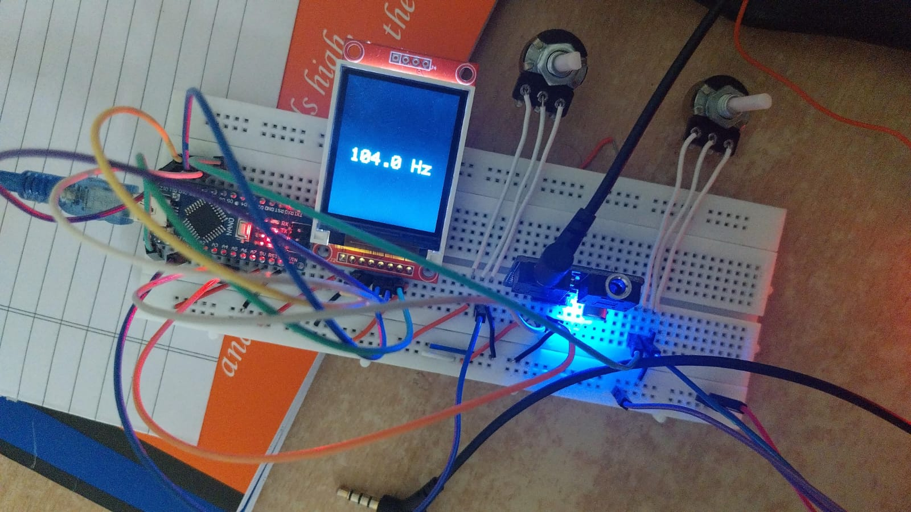
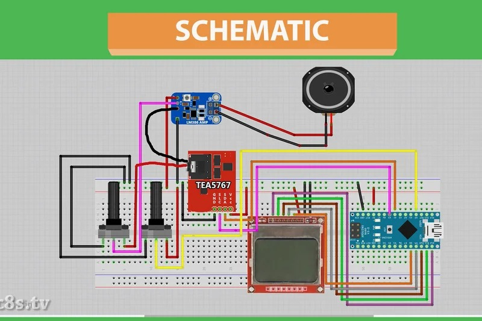

import Link from '@docusaurus/Link';

# TEA5767 Arduino Nano FM Radio Receiver

🧪 PESU Sem 4: Project for Microprocessor and Computer Architecture Course

---

## 👥 Team Members

- Pranav Hemanth – PES1UG23CS433 <Link to="https://github.com/Pranavh-2004">GitHub</Link>
- Nishant Holla – PES1UG23CS401 <Link to="https://github.com/nishantHolla">GitHub</Link>
- Nishant Jayaram Hegde – PES1UG23CS400 <Link to="https://github.com/Nishant9Hegde">GitHub</Link>

---

## 🎯 Project Overview

This project demonstrates an FM Radio Receiver using the **TEA5767** radio module and **Arduino Nano**. A **1.8" SPI TFT Display (ST7735)** is used to show the current frequency, and a potentiometer allows dynamic tuning across the FM band. A 3W speaker connected via an LM386 amplifier outputs the radio audio.

> The goal is to build a fully functional standalone FM receiver with minimal components and intuitive controls.

---

## 🖼️ Final Project Build

Here’s how the final assembled project looks:

---

## ✨ Features

- FM radio reception using TEA5767 module
- Real-time frequency display on 1.8” TFT
- Dynamic tuning using a potentiometer
- Audio output via 3W speaker with LM386 amplifier
- Visual feedback on frequency change

---

## 🧩 Modules and Connections

### 📻 TEA5767 Module (I2C)

| Pin | Connection (Arduino Nano) |
| --- | ------------------------- |
| VCC | 5V                        |
| GND | GND                       |
| SDA | A4                        |
| SCL | A5                        |
| L/R | LM386 Audio Input         |

### 🖥️ 1.8" TFT Display (ST7735)

| Pin   | Connection (Arduino Nano) |
| ----- | ------------------------- |
| CS    | D10                       |
| DC    | D9                        |
| RESET | D8                        |
| SDA   | D11 (MOSI)                |
| SCK   | D13                       |
| VCC   | 5V                        |
| GND   | GND                       |

### 🎛️ Potentiometer (Tuning)

| Pin            | Connection |
| -------------- | ---------- |
| Center (Wiper) | A0         |
| Sides          | 5V & GND   |

### 🔊 LM386 Amplifier (Audio)

- VCC → 5V
- GND → GND
- Audio In → TEA5767 L/R
- Output → 3W Speaker
- Volume Control Pot between Input & GND

---

## 🧰 Circuit Schematic

Below is the schematic diagram of the FM radio receiver:

---

## 🧠 Code Overview

- Analog input from potentiometer (A0) mapped to frequency range (20.0–180.0 MHz)
- Frequency sent to TEA5767 via I2C
- Display updated only on significant frequency change
- Screen uses `Adafruit_GFX` + `ST7735` libraries
- Frequency is centered using custom `printCenter()` function

Code: `main.ino`

---

## ⚙️ Requirements

- Arduino IDE
- Libraries:
  - `Adafruit_GFX`
  - `Adafruit_ST7735`
  - `Wire`
  - `TEA5767 Radio Library`

Install via Arduino Library Manager or GitHub.

---

## 🚀 Future Enhancements

- 📻 Preset button support
- 💾 EEPROM storage of last frequency
- 🎧 Stereo/mono toggle
- ⏲️ Auto-power down using RTC
- 🔍 Auto-scan & signal strength meter

---

## 🔗 References

- <Link to="https://www.instructables.com/Arduino-TEA5767-FM-Radio-Receiver/">Instructables: Arduino TEA5767 FM Radio</Link>
- <Link to="https://learn.adafruit.com/1-8-tft-display">Adafruit ST7735 Documentation</Link>
- <Link to="https://www.nxp.com/docs/en/data-sheet/TEA5767.pdf">TEA5767 Datasheet</Link>

---

## 📄 License

MIT License. See `LICENSE` file for details.
